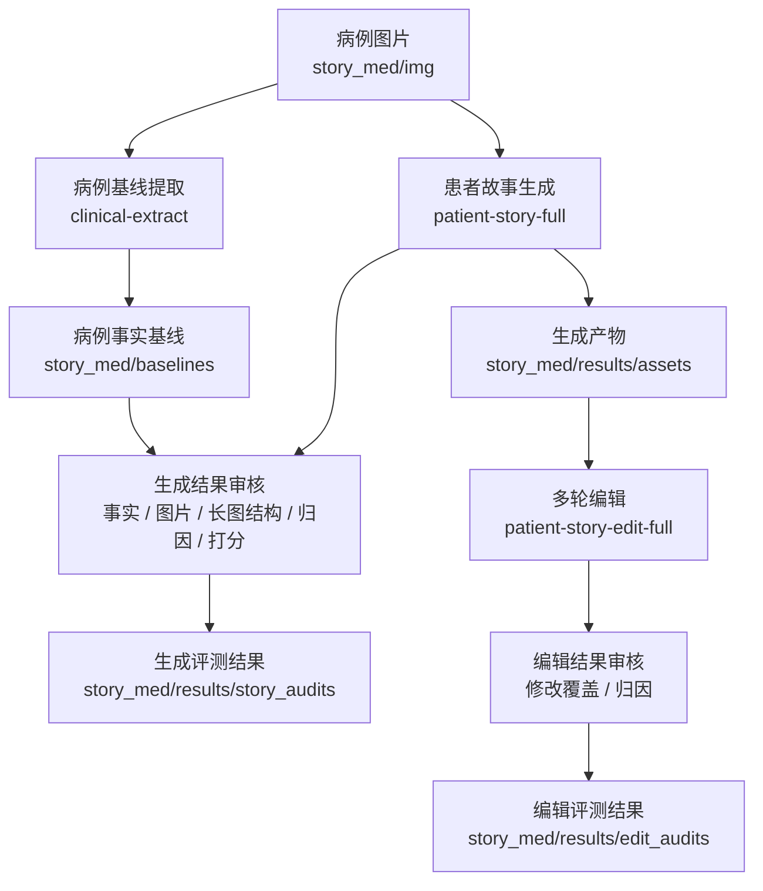

# 患者故事 Agent 评测

用于对患者故事生成链路和多轮编辑链路做自动化评测。项目以病例图片为输入，先提取结构化病例基线，再对患者故事生成结果执行事实审核、图片审核、长图结构审核、归因分析、打分汇总，以及 DeepEval / Confident AI 上报。

## 核心能力

- 病例图片结构化提取：从 `img/` 下的病例图片生成 `clinical_extract.md/json`
- 患者故事生成评测：执行生成链路并完成审核、归因、打分
- 患者故事审核重跑：基于已有生成产物只重跑审核和归因
- 多轮编辑评测：执行编辑对话链路并评估修改覆盖情况
- DeepEval 上报：将 case 级评测结果上报到 Confident AI

## 项目架构



## 目录结构

```text
story_med/
├── baselines/     # 病例图片提取后的结构化基线
├── clients/       # 中台接口、LLM、多模态模型客户端
├── commands/      # CLI 子命令实现
├── config/        # 稳定配置
├── data/          # 测试 case、硬规则模板、编辑对话 case
├── docs/          # 补充文档
├── envs/          # 环境配置模板和本地环境文件
├── executors/     # 生成/编辑链路执行器
├── img/           # 原始病例图片
├── prompts/       # 提取、审核、归因提示词
├── results/       # 生成产物、审核结果、运行记录
├── services/      # 评测编排与业务服务
└── utils/         # 通用工具
```

## 环境要求

- Python 3.12
- `uv`

首次进入项目建议执行：

```bash
uv sync --extra eval
```

依赖管理以 `pyproject.toml` 和 `uv.lock` 为准

## 快速开始

### 1. 准备环境配置

复制环境模板并填写真实配置：

```bash
cp story_med/envs/.env.example story_med/envs/dev.env
```

配置约定：

- `story_med/config/config.yaml`：稳定配置，如 `active_env`、结果路径、DeepEval 配置
- `story_med/envs/dev.env`：环境相关配置，如模型地址、开关、超时、中台地址、账号、密钥

### 2. 提取病例基线

默认批量处理 `story_med/img/` 下全部病例目录：

```bash
uv run story-med clinical-extract
```

只处理单个图片目录：

```bash
uv run story-med clinical-extract --image-dir 卢-肺癌
```

### 3. 执行患者故事生成评测

```bash
uv run story-med patient-story-full \
  --case-ids "SM_001,SM_002" \
  --identifier patient-story-sm001-sm002
```

### 4. 重跑已有产物的审核

```bash
uv run story-med patient-story-audit \
  --case-ids "SM_001,SM_002" \
  --identifier patient-story-audit-only
```

### 5. 执行多轮编辑评测

```bash
uv run story-med patient-story-edit-full --case-ids "EDG_001,EDG_002"
```

## 完整链路执行

完整的患者故事生成和审核链路分两步执行：

### 1. 先提取病例基线

```bash
uv run story-med clinical-extract
```

### 2. 再执行生成 + 审核 + 归因 + 打分

全量执行：

```bash
uv run story-med patient-story-full \
  --identifier patient-story-all-full
```

指定 case 执行：

```bash
uv run story-med patient-story-full \
  --case-ids "SM_001,SM_002" \
  --identifier patient-story-sm001-sm002
```

说明：

- `patient-story-full` 会执行生成、审核、归因、打分，以及 DeepEval 上报
- 如果只想基于已有产物重跑审核，使用 `patient-story-audit`

## 常用命令

| 命令 | 说明 |
| --- | --- |
| `uv run story-med clinical-extract` | 提取病例图片结构化基线 |
| `uv run story-med patient-story-full` | 运行患者故事生成 + 全链路审核 + 归因 + 打分 |
| `uv run story-med patient-story-audit` | 对已有生成产物重跑审核 + 归因 + 打分 |
| `uv run story-med patient-story-edit-full` | 运行多轮编辑执行 + 审核 + 归因 |
| `uv run story-med patient-story-edit-audit` | 对已有编辑产物重跑审核 + 归因 |

`--case-ids` 支持 `,`、`;`、`|` 分隔多个 case。

## 核心流程

### 生成评测链路

1. 读取 `clinical_case.yaml`
2. 按 `image_dir` 加载病例图片
3. 调用内容中台患者故事 Agent 生成大纲、故事、配图、最终长图
4. 基于 `clinical_extract.md` 执行事实审核、图片审核、长图结构审核
5. 输出归因、summary、scorecard，并上报 DeepEval

### 编辑评测链路

1. 读取 `edit_dialogue_cases.yaml`
2. 基于已有患者故事产物执行多轮编辑
3. 对最终长图执行修改覆盖评估
4. 对失败轮次执行编辑归因

## 输入数据

患者故事生成 case 定义在：

```text
story_med/data/clinical_case.yaml
```

编辑评测 case 定义在：

```text
story_med/data/edit_dialogue_cases.yaml
```

病例图片存放在：

```text
story_med/img/{image_dir}/
```

病例事实基线使用：

```text
story_med/baselines/{image_dir}/clinical_extract.md
```

如果 `clinical_extract.md` 不存在，相关审核会直接失败，不会 fallback 到其他文本源。

## 输出目录

```text
story_med/results/assets/            # 生成和编辑后的真实产物
story_med/results/generation_runs/   # 生成链路运行记录
story_med/results/story_audits/      # 生成链路审核、归因、summary
story_med/results/edit_runs/         # 编辑链路运行记录
story_med/results/edit_audits/       # 编辑链路审核、归因
```

生成链路的核心产物包括：

- `case_parse/case_parse.md`
- `generate_outline/outline.md`
- `generate_story/story.md`
- `generate_images/image_design.json`
- `generate_final_image/index.html`
- `generate_final_image/index.png`

## DeepEval / Confident AI

首次上报前先登录：

```bash
uv run deepeval login
```

`patient-story-full` 和 `patient-story-audit` 会在内部触发 Deepeval 测试执行。每个 case 会作为独立 pytest item 上报到 Confident AI。

## 开发与检查

运行核心单测：

```bash
uv run pytest \
  tests/test_clinical_extract_pipeline.py \
  tests/test_patient_story_image_compare.py \
  tests/test_audit_attribution_pipeline.py \
  tests/test_hard_rule_llm_pipeline.py \
  -q
```

确认病例基线已存在：

```bash
find story_med/baselines -maxdepth 2 -name clinical_extract.md | sort
```
